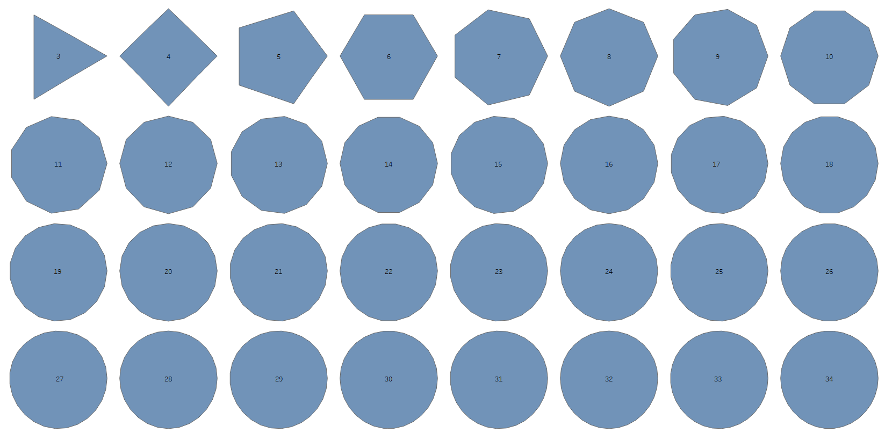
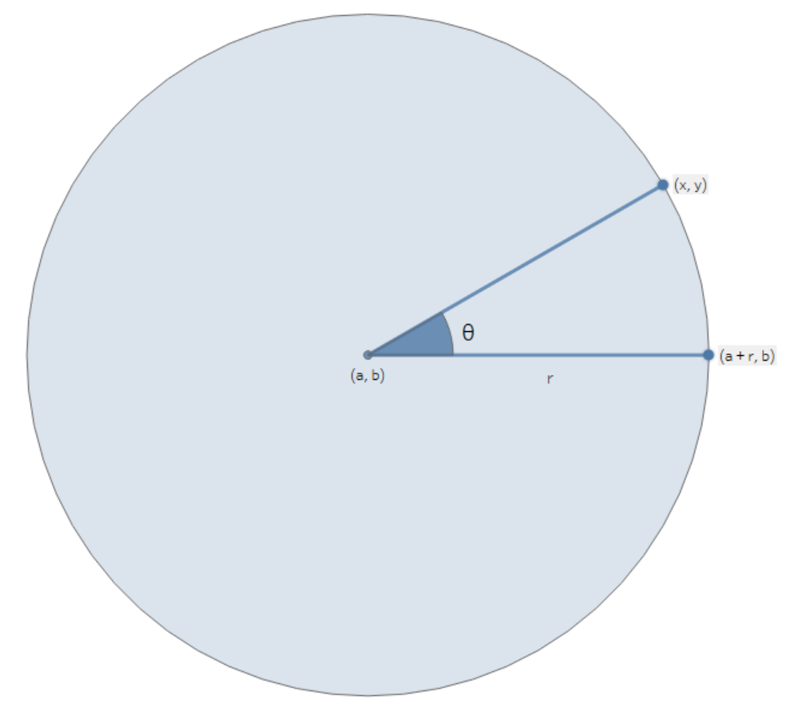
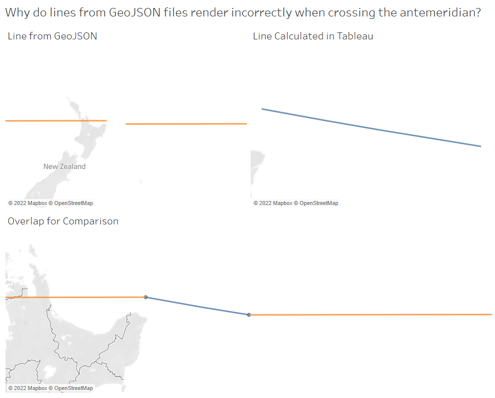

# Circles in Snowflake

This repository contains two methods for generate circle objects in Snowflake from a given center location and radius. Snowflake's understanding of spatial data is based on geographical longitude and latitude instead of a standard two-dimensional coordinate system. This is to support geospatial mapping and has many advantages, including being able to directly display any spatial objects in software such as Tableau on a geographical map.

The blog post describing the process behind this code is available [here](...) <TODO: Add link>

## General Approach

Regardless of which of the two methods you wish to you leverage (described below), the overall approach is the same. Our goal is to generate a number of points along the boundary of our circle, then connect these points to create an approximation of the circle itself. The image below demonstrates how our circle approximation becomes more accurate as the number of points is increased.



## Generating Circles on a Flat Two-Dimensional Plane

If you are not mapping your circles onto a geospatial map and instead wish to treat your canvas as a simple two-dimensional plane, you can calculate points on circles with a relatively simple formula.

### Mathematical Approach for Flat Planes

Consider a circle with center `(a, b)` and radius `r`, as in the image below.



Within these contraints, point `(x, y)` can be calculated with the following formula:

```math
x = a + rcos(θ)
```

```math
y = b + rsin(θ)
```

If we ensure all of our values are small enough to fit on a relatively flat section of the Earth, for example by dividing all of our coordinates and distances by Snowflake's approximation of the distance between `(0,0)` and `(0,1)`, then we can reasonably assume that our canvas is a flat two-dimensional plane and plot our circles against it.

## Generating Circles on a Geospatial Surface (such as Earth)

If you wish to map your circles onto a geospatial surface such as the surface of Earth, the formula becomes more complex. We must now consider the curviture of the sphere whilst calculating the points on our circle, and can expect some odd-looking oval-shaped results when viewing our circles on a [Mercator projection](https://en.wikipedia.org/wiki/Mercator_projection), which is how we typically view the world on a map.

### Mathematical Approach for Geospatial Mapping

Consider a starting point with latitude `φ_1` and longitude `λ_1`, both calculated in radians. We wish to travel a distance `d` in a specific direction. In geospatial environments, the direction of travel is referred to as the bearing and is measured as the angle `θ` in radians travelling clockwise from the northward meridian to the direction of travel. We must also know the Earth's radius `R`.

First, we calculate the angular distance `δ`, which is the internal angle at the planet's core between our origin and desired destination.

```math
δ = d/R
```

Now that we know the angular distance, we can calculate the destination location with latitude `φ_2` and longitude `λ_2` in radians, using the following formulae:

```math
φ_2 = asin(sin(φ_1)cos(δ) + cos(φ_1)sin(δ)cos(θ))
```

```math
λ_2 = λ_1 + atan2(sin(θ)sin(δ)cos(φ_1), cos(δ) - sin(φ_1)sin(φ_2))
```

### Challenges with Geospatial Mapping

This gets us most of the way there, however we still face two issues.

#### Boundary for Longitude

The longitude must fit within the boundaries of `-π <= λ_2 <= π`. To resolve this, we can apply the following formula:

```math
((λ_2 + 3π) \% 2π) - π
```

In degrees instead of radians, our goal is to stay between -180° and 180°. This can be achieved with the following converted formula:

```math
((lat_2 + 540) \% 360) - 180
```

#### Rendering Across the Antimeridian

Like many tools, Snowflake leverages the GeoJSON data format to store geospatial data. GeoJSON faces a challenge when shapes cross the antimeridian, where East becomes West. When this occurs, rendering will loop all the way around the world instead of crossing the antimeridian.

The image below demonstrates how this can fail to render in Tableau (orange), compared to the desired intention (blue).



To correct this, we must cut our shape exactly at the antimerdian boundary, starting a new set of lines for our circle each time it crosses -180° or 180° longitude. As our circle is an approximation based on a number of points, it is acceptable for us to simply apply a standard `y = mx + c` approach here to find the equation for the line that crosses the antimeridian and add a break point where `x = 180` or `x = -180`. We can then start a new set of lines from the opposite end of the axis.

For example, consider the following GeoJSON line which crosses the antimeridian:

```json
{
  "type": "LineString",
  "coordinates": [
    [177, 0], [179, 0], [-179, 0], [-177, 0]
  ]
}
```

To cut this, we would convert from a `LineString` object type to a `MultiLineString` that combines several lines that are clearly separated at the antimeridian:

```json
{
  "type": "MultiLineString",
  "coordinates": [
    [
      [177, 0], [179, 0], [180, 0]
    ],
    [
      [-180, 0], [-179, 0], [-177, 0]
    ]
  ]
}
```

Unfortunately, I have not been able to find a way to achieve this successfully in Snowflake at this time. I do not believe Snowflake's current GeoJSON functionality supports constructing polygons that are formed of MultiLineString object types. For now, my recommendation is to avoid using Snowflake for geospatial mapping when you know you will cross the antimeridian.

#### Credit

This repository has been authored by [Chris Hastie](https://interworks.com/people/chris-hastie/).

My colleague [Karl Young](https://interworks.com/people/karl-young) supported with testing and refinement.

The variant of the Haversine formula that we have used to calculate points on a geospatial surface was sourced from [Movable Type Scripts](https://www.movable-type.co.uk/scripts/latlong.html).
